[回到知識庫總索引](https://released.github.io/)

<a id="article_top"></a>

# RH850 UART0 DMA TX / RX (DMA/interrupt + idle timer)

> 以 RH850/F1KM-S1 為例，串接 UART、DMA、interrupt、idle timer、PEG 保護與 SRAM 配置，建立可追蹤的 TX / RX 資料流。

## 閱讀重點

- 先從 system overview 確認 UART、DMA channel、buffer 與 interrupt 的責任分工。
- 再核對 bus master、PEG、register base address 與 linker section，確保 DMA 能存取目標 SRAM。
- 最後用 watch window、封包紀錄與 idle timeout 驗證資料完整性。

## Reference Project

This training material is based on the **below reference project**:

- [Sample_Project_RH850_S1_UART_TX_DMA_RX_interrupt](https://github.com/released/Sample_Project_RH850_S1_UART_TX_DMA_RX_interrupt)

- [Sample_Project_RH850_S1_UART_TX_RX_DMA](https://github.com/released/Sample_Project_RH850_S1_UART_TX_RX_DMA)

## Agenda

* [System overview](#article_overview)
* [DMA access: PEG & register update](#article_peg)
* [Memory map](#article_mem_map)
* [SRAM allocation (DMA buffer)](#article_sram)
* [DMA address / register map](#article_dma_addr)
* [UART address / register map](#article_uart_addr)
* [Smart Config settings](#article_smc)
* [Code flow: TX DMA / RX interrupt / / RX DMA](#article_code_flow)
* [RX idle detection timer](#article_rx_idle)
* [Debug watch window](#article_watch)

---

<a id="article_overview"></a>

## 1. System overview

### Base board & MCU

* EVM : Y-BLDC-SK-RH850F1KM-S1-V2 (R7F701684/LQFP100/1MB flash)
* project MCU change to R7F7016923 (LQFP64/512K flash)

### Peripherals

* TAUJ0_0 : timer interval for 1ms interrupt

* UART1 : RLIN31 (TX > P10_12 , RX > P10_11) , for printf and receive from keyboard

* TAUJ1_0 : timer interval for UART1 RX idle byte detection
  * baud rate 115200 : 217us
  * baud rate 415000 : 60.24us

* UART0 : RLIN30 (TX > P10_10 , RX > P10_09)
  * UART0 TX : DMA
  * UART0 RX : DMA/regular interrupt , with timer IRQ for idle detection
		
* check below define in app_uart0_config.h
		
```c
/* UART0 RX mode select: 1 = DMA RX, 0 = interrupt RX-only */
#define APP_UART0_RX_MODE_DMA       (1U)
```		

* modify cstart.asm , to increase stack size
		
```c
;-----------------------------------------------------------------------------
;	system stack
;-----------------------------------------------------------------------------
STACKSIZE	.set	0x1000
	.section	".stack.bss", bss
	.align	4
	.ds	(STACKSIZE)
	.align	4
_stacktop:
```

[back to top](#article_top)

---

<a id="article_peg"></a>

## 2. DMA access: PEG & register update

Before using DMA to access SRAM, **PEG registers must be configured**.

* set `PEG.SP` (SPEN = 1)
* set `PEG.GnMK`
* set `PEG.GnBA`
* set `PDMAnDMyiCM`
* set `PDMA0.DM00CM / DM01CM` (SPID / PE / supervisor)

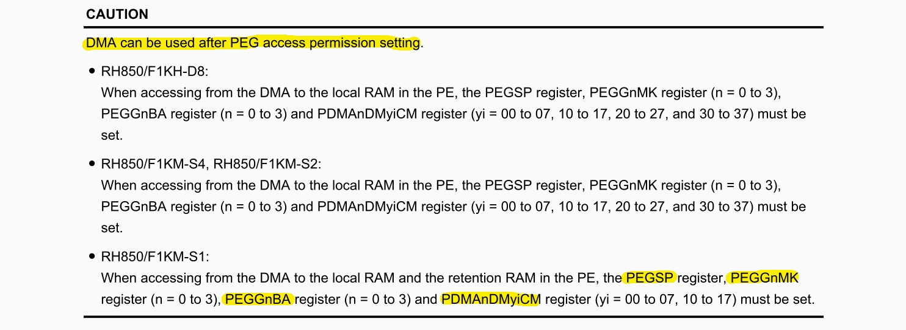

### PEG register references

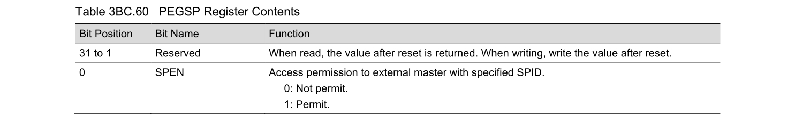

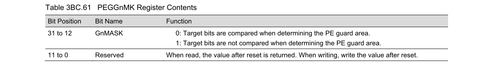

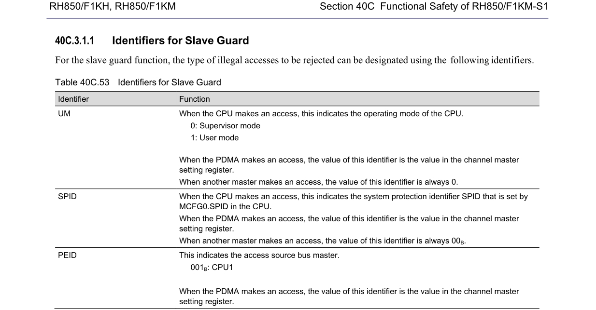

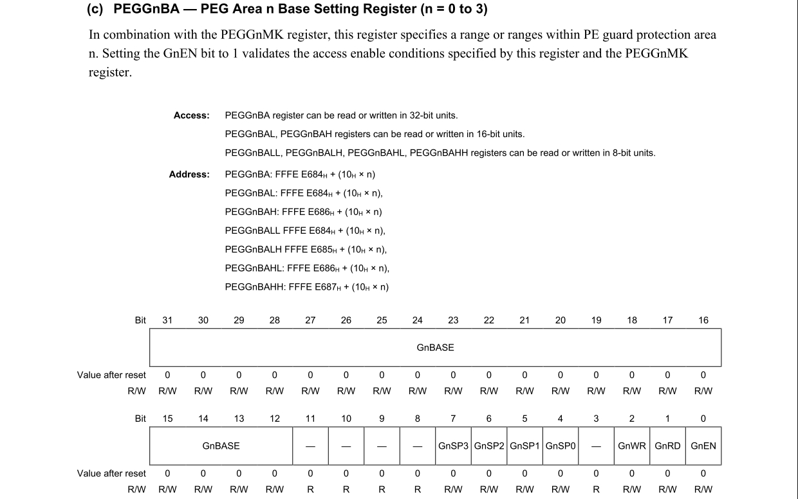

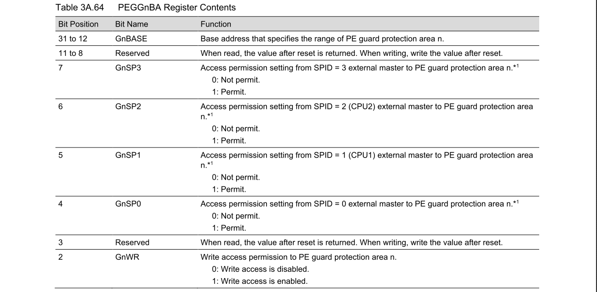

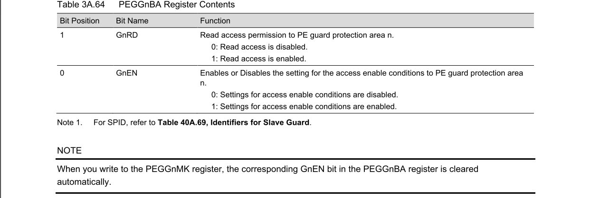

### Example code

```c
PDMA0.DM00CM = _DMAC_PE1_SETTING | _DMAC_SPID0_SETTING | _DMAC_SUPERVISON_MODE;    
PDMA0.DM01CM = _DMAC_PE1_SETTING | _DMAC_SPID0_SETTING | _DMAC_SUPERVISON_MODE;
PEG.SP.UINT32 = 0x00000001U;                /* SPEN = 1, permit access */
PEG.G0MK.UINT32 = 0xFFFFF000U;              /* 32KB window mask */
PEG.G0BA.UINT32 = ADDR_LOCAL_RAM_CPU1 |     /* Base address of PE Guard protection Area (start of Local RAM) */
                (0x1U<<7U) |                /* Enable Access for SPID 3 */
                (0x1U<<6U) |                /* Enable Access for SPID 2 */
                (0x1U<<5U) |                /* Enable Access for SPID 1 */
                (0x1U<<4U) |                /* Enable Access for SPID 0 */
                (0x1U<<2U) |                /* Write access is enabled */
                (0x1U<<1U) |                /* Read access is enabled */
                (0x1U<<0U);                 /* Settings for access enable conditions are enabled */
```

```c
/* LOCAL_RAM_CPU1 start address (PEG) */
#define ADDR_LOCAL_RAM_CPU1         (0xFEBF0000)
```

[back to top](#article_top)

---

<a id="article_mem_map"></a>

## 3. Memory map (RH850/F1KM-S1)


| FLASH  | LOCAL RAM(CPU1) | RETENTION RAM(CPU1) | LOCAL RAM(SELF) | RETENTION RAM(SELF) |
|--------|-----------------|--------------------|----------------|---------------------|
| 512K   | `0xFEBF0000 ~ 0xFEBF7FFF` | `0xFEBF8000 ~ 0xFEBFFFFF` | `0xFEDF0000 ~ 0xFEDF7FFF` | `0xFEDF8000 ~ 0xFEDFFFFF` |
| 768K   | `0xFEBE8000 ~ 0xFEBF7FFF` | `0xFEBF8000 ~ 0xFEBFFFFF` | `0xFEDE8000 ~ 0xFEDF7FFF` | `0xFEDF8000 ~ 0xFEDFFFFF` |
| 1MB    | `0xFEBE0000 ~ 0xFEBF7FFF` | `0xFEBF8000 ~ 0xFEBFFFFF` | `0xFEDE0000 ~ 0xFEDF7FFF` | `0xFEDF8000 ~ 0xFEDFFFFF` |

### Memory map + Product lineup memo

Source:
- `REN_r01uh0684ej0130-rh850f1kh-rh850f1km_MAH_20210929.pdf`
- Section `1A/1B/1C.3 Product Lineup`
- Section `45.2 Memory Configuration` (Figure `45.1` to `45.4`)

#### F1KM-S1


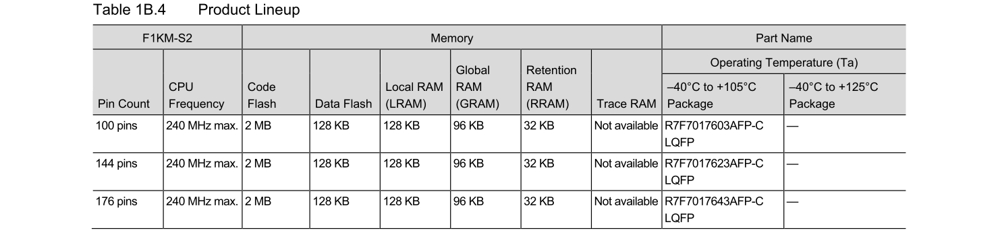


| Series | Pin count | Code Flash size | LOCAL RAM(CPU1) | RETENTION RAM(CPU1) | LOCAL RAM(SELF) | RETENTION RAM(SELF) | Part Name |
|--------|-----------|-------|-----------------|---------------------|-----------------|---------------------|-----------|
| F1KM-S1 | 100 | 512K | `0xFEBF0000 ~ 0xFEBF7FFF` | `0xFEBF8000 ~ 0xFEBFFFFF` | `0xFEDF0000 ~ 0xFEDF7FFF` | `0xFEDF8000 ~ 0xFEDFFFFF` | `105C: R7F7016863AFP-C / 125C: R7F7016864AFP-C` |
| F1KM-S1 | 100 | 768K | `0xFEBE8000 ~ 0xFEBF7FFF` | `0xFEBF8000 ~ 0xFEBFFFFF` | `0xFEDE8000 ~ 0xFEDF7FFF` | `0xFEDF8000 ~ 0xFEDFFFFF` | `105C: R7F7016853AFP-C / 125C: R7F7016854AFP-C` |
| F1KM-S1 | 100 | 1MB | `0xFEBE0000 ~ 0xFEBF7FFF` | `0xFEBF8000 ~ 0xFEBFFFFF` | `0xFEDE0000 ~ 0xFEDF7FFF` | `0xFEDF8000 ~ 0xFEDFFFFF` | `105C: R7F7016843AFP-C / 125C: R7F7016844AFP-C` |
| F1KM-S1 | 80 | 512K | `0xFEBF0000 ~ 0xFEBF7FFF` | `0xFEBF8000 ~ 0xFEBFFFFF` | `0xFEDF0000 ~ 0xFEDF7FFF` | `0xFEDF8000 ~ 0xFEDFFFFF` | `105C: R7F7016893AFP-C / 125C: R7F7016894AFP-C` |
| F1KM-S1 | 80 | 768K | `0xFEBE8000 ~ 0xFEBF7FFF` | `0xFEBF8000 ~ 0xFEBFFFFF` | `0xFEDE8000 ~ 0xFEDF7FFF` | `0xFEDF8000 ~ 0xFEDFFFFF` | `105C: R7F7016883AFP-C / 125C: R7F7016884AFP-C` |
| F1KM-S1 | 80 | 1MB | `0xFEBE0000 ~ 0xFEBF7FFF` | `0xFEBF8000 ~ 0xFEBFFFFF` | `0xFEDE0000 ~ 0xFEDF7FFF` | `0xFEDF8000 ~ 0xFEDFFFFF` | `105C: R7F7016873AFP-C / 125C: R7F7016874AFP-C` |
| F1KM-S1 | 64 | 512K | `0xFEBF0000 ~ 0xFEBF7FFF` | `0xFEBF8000 ~ 0xFEBFFFFF` | `0xFEDF0000 ~ 0xFEDF7FFF` | `0xFEDF8000 ~ 0xFEDFFFFF` | `105C: R7F7016923AFP-C / 125C: R7F7016924AFP-C` |
| F1KM-S1 | 64 | 768K | `0xFEBE8000 ~ 0xFEBF7FFF` | `0xFEBF8000 ~ 0xFEBFFFFF` | `0xFEDE8000 ~ 0xFEDF7FFF` | `0xFEDF8000 ~ 0xFEDFFFFF` | `105C: R7F7016913AFP-C / 125C: R7F7016914AFP-C` |
| F1KM-S1 | 64 | 1MB | `0xFEBE0000 ~ 0xFEBF7FFF` | `0xFEBF8000 ~ 0xFEBFFFFF` | `0xFEDE0000 ~ 0xFEDF7FFF` | `0xFEDF8000 ~ 0xFEDFFFFF` | `105C: R7F7016903AFP-C / 125C: R7F7016904AFP-C` |
| F1KM-S1 | 48 | 512K | `0xFEBF0000 ~ 0xFEBF7FFF` | `0xFEBF8000 ~ 0xFEBFFFFF` | `0xFEDF0000 ~ 0xFEDF7FFF` | `0xFEDF8000 ~ 0xFEDFFFFF` | `105C: R7F7016953AFP-C / 125C: R7F7016954AFP-C` |
| F1KM-S1 | 48 | 768K | `0xFEBE8000 ~ 0xFEBF7FFF` | `0xFEBF8000 ~ 0xFEBFFFFF` | `0xFEDE8000 ~ 0xFEDF7FFF` | `0xFEDF8000 ~ 0xFEDFFFFF` | `105C: R7F7016943AFP-C / 125C: R7F7016944AFP-C` |
| F1KM-S1 | 48 | 1MB | `0xFEBE0000 ~ 0xFEBF7FFF` | `0xFEBF8000 ~ 0xFEBFFFFF` | `0xFEDE0000 ~ 0xFEDF7FFF` | `0xFEDF8000 ~ 0xFEDFFFFF` | `105C: R7F7016933AFP-C / 125C: R7F7016934AFP-C` |

#### F1KM-S2


| Series | Pin count | Code Flash size | LOCAL RAM(CPU1) | RETENTION RAM(Bank B) | LOCAL RAM(SELF) | GLOBAL RAM(Bank A) | GLOBAL RAM(Bank B) | Part Name |
|--------|-----------|-------|-----------------|-----------------------|-----------------|--------------------|--------------------|-----------|
| F1KM-S2 | 100 | 2MB | `0xFEBE0000 ~ 0xFEBFFFFF` | `0xFEF08000 ~ 0xFEF0FFFF` | `0xFEDE0000 ~ 0xFEDFFFFF` | `0xFEEF4000 ~ 0xFEEFFFFF` | `0xFEFF4000 ~ 0xFEFFFFFF` | `105C: R7F7017603AFP-C / 125C: -` |
| F1KM-S2 | 144 | 2MB | `0xFEBE0000 ~ 0xFEBFFFFF` | `0xFEF08000 ~ 0xFEF0FFFF` | `0xFEDE0000 ~ 0xFEDFFFFF` | `0xFEEF4000 ~ 0xFEEFFFFF` | `0xFEFF4000 ~ 0xFEFFFFFF` | `105C: R7F7017623AFP-C / 125C: -` |
| F1KM-S2 | 176 | 2MB | `0xFEBE0000 ~ 0xFEBFFFFF` | `0xFEF08000 ~ 0xFEF0FFFF` | `0xFEDE0000 ~ 0xFEDFFFFF` | `0xFEEF4000 ~ 0xFEEFFFFF` | `0xFEFF4000 ~ 0xFEFFFFFF` | `105C: R7F7017643AFP-C / 125C: -` |

#### F1KM-S4


| Series | Pin count | Code Flash size | LOCAL RAM(CPU1) | RETENTION RAM(Bank B) | LOCAL RAM(SELF) | GLOBAL RAM(Bank A) | GLOBAL RAM(Bank B) | Part Name |
|--------|-----------|-------|-----------------|-----------------------|-----------------|--------------------|--------------------|-----------|
| F1KM-S4 | 100 | 3MB | `0xFEBD0000 ~ 0xFEBFFFFF` | `0xFEF00000 ~ 0xFEF0FFFF` | `0xFEDD0000 ~ 0xFEDFFFFF` | `0xFEEF0000 ~ 0xFEEFFFFF` | `0xFEFF0000 ~ 0xFEFFFFFF` | `105C: R7F7016443AFP-C / 125C: -` |
| F1KM-S4 | 100 | 4MB | `0xFEBC0000 ~ 0xFEBFFFFF` | `0xFEF00000 ~ 0xFEF0FFFF` | `0xFEDC0000 ~ 0xFEDFFFFF` | `0xFEEE8000 ~ 0xFEEFFFFF` | `0xFEFE8000 ~ 0xFEFFFFFF` | `105C: R7F7016453AFP-C / 125C: -` |
| F1KM-S4 | 144 | 3MB | `0xFEBD0000 ~ 0xFEBFFFFF` | `0xFEF00000 ~ 0xFEF0FFFF` | `0xFEDD0000 ~ 0xFEDFFFFF` | `0xFEEF0000 ~ 0xFEEFFFFF` | `0xFEFF0000 ~ 0xFEFFFFFF` | `105C: R7F7016463AFP-C / 125C: -` |
| F1KM-S4 | 144 | 4MB | `0xFEBC0000 ~ 0xFEBFFFFF` | `0xFEF00000 ~ 0xFEF0FFFF` | `0xFEDC0000 ~ 0xFEDFFFFF` | `0xFEEE8000 ~ 0xFEEFFFFF` | `0xFEFE8000 ~ 0xFEFFFFFF` | `105C: R7F7016473AFP-C / 125C: -` |
| F1KM-S4 | 176 | 3MB | `0xFEBD0000 ~ 0xFEBFFFFF` | `0xFEF00000 ~ 0xFEF0FFFF` | `0xFEDD0000 ~ 0xFEDFFFFF` | `0xFEEF0000 ~ 0xFEEFFFFF` | `0xFEFF0000 ~ 0xFEFFFFFF` | `105C: R7F7016483AFP-C / 125C: -` |
| F1KM-S4 | 176 | 4MB | `0xFEBC0000 ~ 0xFEBFFFFF` | `0xFEF00000 ~ 0xFEF0FFFF` | `0xFEDC0000 ~ 0xFEDFFFFF` | `0xFEEE8000 ~ 0xFEEFFFFF` | `0xFEFE8000 ~ 0xFEFFFFFF` | `105C: R7F7016493AFP-C / 125C: -` |
| F1KM-S4 | 233 | 3MB | `0xFEBD0000 ~ 0xFEBFFFFF` | `0xFEF00000 ~ 0xFEF0FFFF` | `0xFEDD0000 ~ 0xFEDFFFFF` | `0xFEEF0000 ~ 0xFEEFFFFF` | `0xFEFF0000 ~ 0xFEFFFFFF` | `105C: R7F7016503ABG-C / 125C: R7F7016504ABG-C` |
| F1KM-S4 | 233 | 4MB | `0xFEBC0000 ~ 0xFEBFFFFF` | `0xFEF00000 ~ 0xFEF0FFFF` | `0xFEDC0000 ~ 0xFEDFFFFF` | `0xFEEE8000 ~ 0xFEEFFFFF` | `0xFEFE8000 ~ 0xFEFFFFFF` | `105C: R7F7016513ABG-C / 125C: R7F7016514ABG-C` |
| F1KM-S4 | 272 | 3MB | `0xFEBD0000 ~ 0xFEBFFFFF` | `0xFEF00000 ~ 0xFEF0FFFF` | `0xFEDD0000 ~ 0xFEDFFFFF` | `0xFEEF0000 ~ 0xFEEFFFFF` | `0xFEFF0000 ~ 0xFEFFFFFF` | `105C: R7F7016523ABG-C / 125C: R7F7016524ABG-C` |
| F1KM-S4 | 272 | 4MB | `0xFEBC0000 ~ 0xFEBFFFFF` | `0xFEF00000 ~ 0xFEF0FFFF` | `0xFEDC0000 ~ 0xFEDFFFFF` | `0xFEEE8000 ~ 0xFEEFFFFF` | `0xFEFE8000 ~ 0xFEFFFFFF` | `105C: R7F7016533ABG-C / 125C: R7F7016534ABG-C` |

#### F1KH-D8


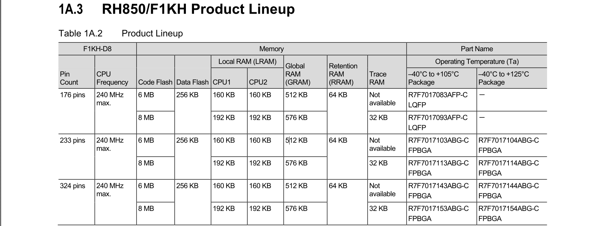


| Series | Pin count | Code Flash size | LOCAL RAM(CPU1) | LOCAL RAM(CPU2) | RETENTION RAM(Bank B) | GLOBAL RAM(Bank A) | GLOBAL RAM(Bank B) | Part Name |
|--------|-----------|-------|-----------------|-----------------|-----------------------|--------------------|--------------------|-----------|
| F1KH-D8 | 176 | 6MB | `0xFEBD8000 ~ 0xFEBFFFFF` | `0xFEDD8000 ~ 0xFEDFFFFF` | `0xFEF00000 ~ 0xFEF0FFFF` | `0xFEEC0000 ~ 0xFEEFFFFF` | `0xFEFC0000 ~ 0xFEFFFFFF` | `105C: R7F7017083AFP-C / 125C: -` |
| F1KH-D8 | 176 | 8MB | `0xFEBD0000 ~ 0xFEBFFFFF` | `0xFEDD0000 ~ 0xFEDFFFFF` | `0xFEF00000 ~ 0xFEF0FFFF` | `0xFEEB8000 ~ 0xFEEFFFFF` | `0xFEFB8000 ~ 0xFEFFFFFF` | `105C: R7F7017093AFP-C / 125C: -` |
| F1KH-D8 | 233 | 6MB | `0xFEBD8000 ~ 0xFEBFFFFF` | `0xFEDD8000 ~ 0xFEDFFFFF` | `0xFEF00000 ~ 0xFEF0FFFF` | `0xFEEC0000 ~ 0xFEEFFFFF` | `0xFEFC0000 ~ 0xFEFFFFFF` | `105C: R7F7017103ABG-C / 125C: R7F7017104ABG-C` |
| F1KH-D8 | 233 | 8MB | `0xFEBD0000 ~ 0xFEBFFFFF` | `0xFEDD0000 ~ 0xFEDFFFFF` | `0xFEF00000 ~ 0xFEF0FFFF` | `0xFEEB8000 ~ 0xFEEFFFFF` | `0xFEFB8000 ~ 0xFEFFFFFF` | `105C: R7F7017113ABG-C / 125C: R7F7017114ABG-C` |
| F1KH-D8 | 324 | 6MB | `0xFEBD8000 ~ 0xFEBFFFFF` | `0xFEDD8000 ~ 0xFEDFFFFF` | `0xFEF00000 ~ 0xFEF0FFFF` | `0xFEEC0000 ~ 0xFEEFFFFF` | `0xFEFC0000 ~ 0xFEFFFFFF` | `105C: R7F7017143ABG-C / 125C: R7F7017144ABG-C` |
| F1KH-D8 | 324 | 8MB | `0xFEBD0000 ~ 0xFEBFFFFF` | `0xFEDD0000 ~ 0xFEDFFFFF` | `0xFEF00000 ~ 0xFEF0FFFF` | `0xFEEB8000 ~ 0xFEEFFFFF` | `0xFEFB8000 ~ 0xFEFFFFFF` | `105C: R7F7017153ABG-C / 125C: R7F7017154ABG-C` |

CPU1 area vs Self area


DMA access area (only allow access __CPU1 area__)

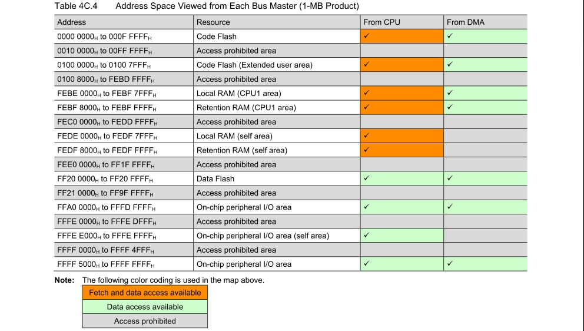

[back to top](#article_top)

---

<a id="article_sram"></a>

## 4. SRAM allocation (DMA buffer)

Need to allocate SRAM section for DMA buffer.

* Example (FLASH 512K) : `dma_buf` at `0xFEBF0000`

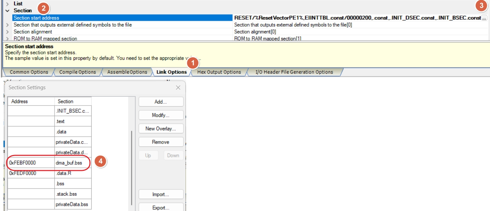

Define TX / RX DMA buffers in `dma_buf` section:

```c
#pragma section dma_buf
volatile uint8_t s_uart0_dma_rx_ring[APP_UART0_DMA_RX_RING_SIZE];
volatile uint8_t s_uart0_dma_tx_buf[APP_UART0_DMA_TX_BUF_SIZE];
#pragma section default
```

DMA buffer allocation result in map file:

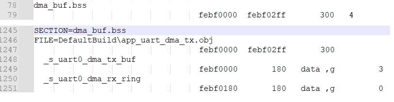

### UART DMA TX / RX config

| Item | DMA source address | DMA source address count direction | DMA dest. address | DMA dest. address count direction |
|------|--------------------|------------------------------------|------------------|-----------------------------------|
| TX | `s_uart0_dma_tx_buf` | increase | `APP_UART0_TX_DR` | fix |
| RX | `APP_UART0_RX_DR` | fix | `s_uart0_dma_rx_ring` | increase |

[back to top](#article_top)

---

<a id="article_dma_addr"></a>

## 5. DMA address / register map

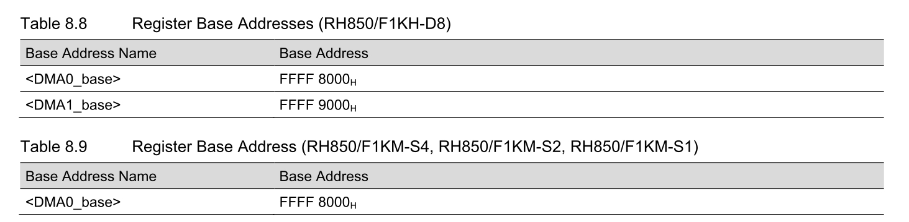

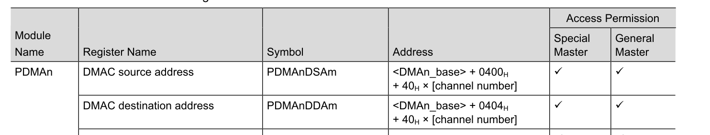

[back to top](#article_top)

---

<a id="article_uart_addr"></a>

## 6. UART address / register map

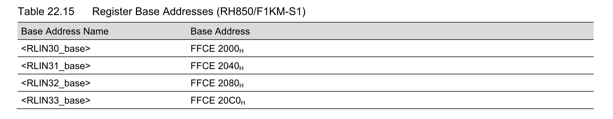

TX : `RLN3nLUTDR`

RX : `RLN3nLURDR`

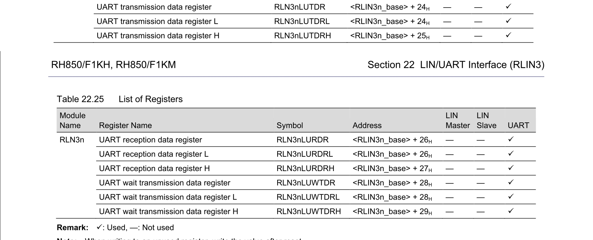

[back to top](#article_top)

---

<a id="article_smc"></a>

## 7. Smart Config settings

Target trigger source : UART0

* `INTRLIN30UR0` : RLIN30 transmit interrupt

* `INTRLIN30UR1` : RLIN30 receive complete interrupt

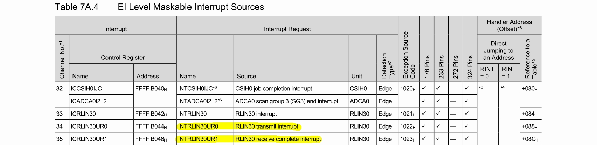

TX configuration

* src : set in code (`s_uart0_dma_tx_buf`)
* dest : set in code (`APP_UART0_TX_DR`)
* src count : increase
* dest count : fixed

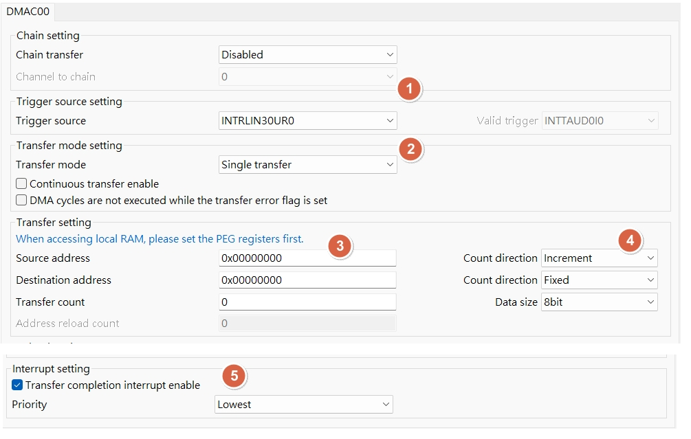

RX configuration

* src : set in code (`APP_UART0_RX_DR`)
* dest : set in code (`s_uart0_dma_rx_ring`)
* src count : fixed
* dest count : increase

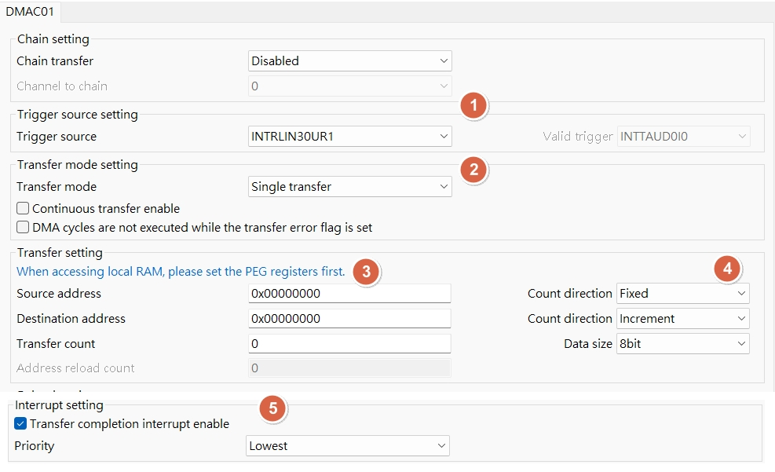

[back to top](#article_top)

---

<a id="article_code_flow"></a>

## 8. Code flow: TX DMA / RX interrupt

### TX DMA (UART0)

Goal: CPU prepares a buffer, DMA moves bytes to UART0 TX data register.

Flow summary:

* Prepare `s_uart0_dma_tx_buf[]` with payload.
* Configure DMA source = buffer, dest = `APP_UART0_TX_DR`.
* Set count = payload length, src count increment, dest count fixed.
* Enable DMA channel, UART0 TX trigger kicks DMA per byte.
* TX done interrupt (or DMA end flag) marks completion.

Notes:

* TX DMA uses `INTRLIN30UR0` trigger.
* `PDMA0.DM00CM` must include PE/SPID/supervisor settings before start.

```c

void APP_UART0_DMA_TxSend(const uint8_t *data, uint16_t len)
{
    uint16_t copy_len;
 
    // memset(s_uart0_dma_tx_buf, 0xAA, sizeof(s_uart0_dma_tx_buf));


    if ((data == 0) || (len == 0U))
    {
        return;
    }

    while (UART0_TX_IS_BUSY())
    {
        /* wait until TX can accept data */
    }

    R_Config_DMAC00_Suspend();
    R_Config_DMAC00_Stop();
    (void)DRV_DMA_ClearTcAndErr(APP_UART0_DMA_UNIT, APP_UART0_DMA_TX_CH);

    copy_len = app_uart0_dma_txbuf_write(data, len);
    if (copy_len == 0U)
    {
        return;
    }
    // tiny_printf("len2:%u\r\n", len);
    // tiny_printf("copy_len2:%u\r\n", copy_len);

    APP_UART0_DMA_SetCh0(copy_len);
                              
    s_uart0_dma_tx_busy = 1U;
    R_Config_DMAC00_Resume();
    R_Config_DMAC00_Start();

    APP_UART0_TX_DR = s_uart0_dma_tx_buf[0];

    // while (! (PDMA0.DCST0 & _DMAC_TRANSFER_COMPLETION_FLAG_CLEAR));
    while (s_uart0_dma_tx_busy != 0U)
    {
        /* optional: add timeout / feed WDT */
    }
}

```

### RX interrupt (UART0)

Goal: Use UART RX interrupt to capture bytes into a ring buffer, then use idle timer to decide a frame is complete.

Flow summary:

* Enable UART0 RX interrupt (no DMA for RX).
* RX ISR reads `APP_UART0_RX_DR` and pushes into `s_uart0_dma_rx_ring[]`.
* Each RX byte restarts the idle timer.
* Timer expiry => treat as end-of-frame, stop UART, set `g_rcv_data_finish`.
* Main loop checks flag, processes buffer, then re-arm UART + timer.

Notes:

* RX uses `INTRLIN30UR1` interrupt source.
* RX buffer is in `dma_buf` section to ensure DMA-safe SRAM layout, even though RX is interrupt based.


[back to top](#article_top)

---

### UART TX / RX : WRITE/READ packet design flow

Target : communicate with GMSL device

* MCU send WRITE packet to GMSL
```c
/* GMSL UART Base Mode WRITE packet format (MCU -> GMSL):
 * [0] SYNC        = 0x79
 * [1] DEV_ADDR_RW = (dev_addr << 1) | 0
 * [2] REG_ADDR
 * [3] LEN         = N (1..255, 256 => 0x00)
 * [4..] DATA[0..N-1]
 *
 * Response (GMSL -> MCU): ACK 0xC3 only.
 */
```

* MCU send READ packet to GMSL
```c

/* GMSL UART Base Mode READ request format (MCU -> GMSL):
 * [0] SYNC        = 0x79
 * [1] DEV_ADDR_RW = (dev_addr << 1) | 1
 * [2] REG_ADDR
 * [3] LEN         = N (1..255, 256 => 0x00)
 *
 * Response (GMSL -> MCU): ACK 0xC3 + DATA[0..N-1].
 */
```

* WRITE/READ packet design flow

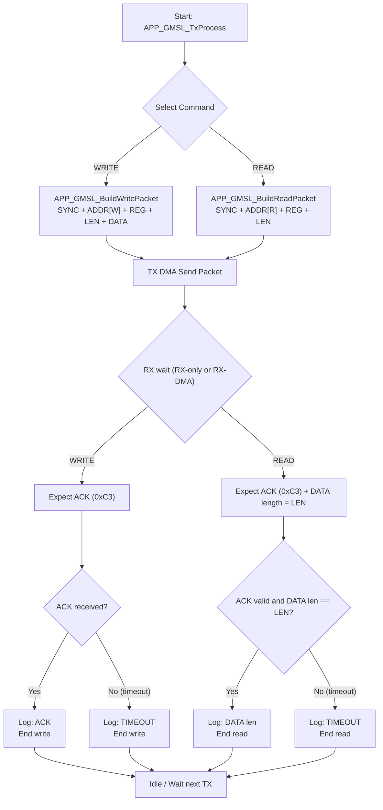

* RX only vs RX DMA detail difference

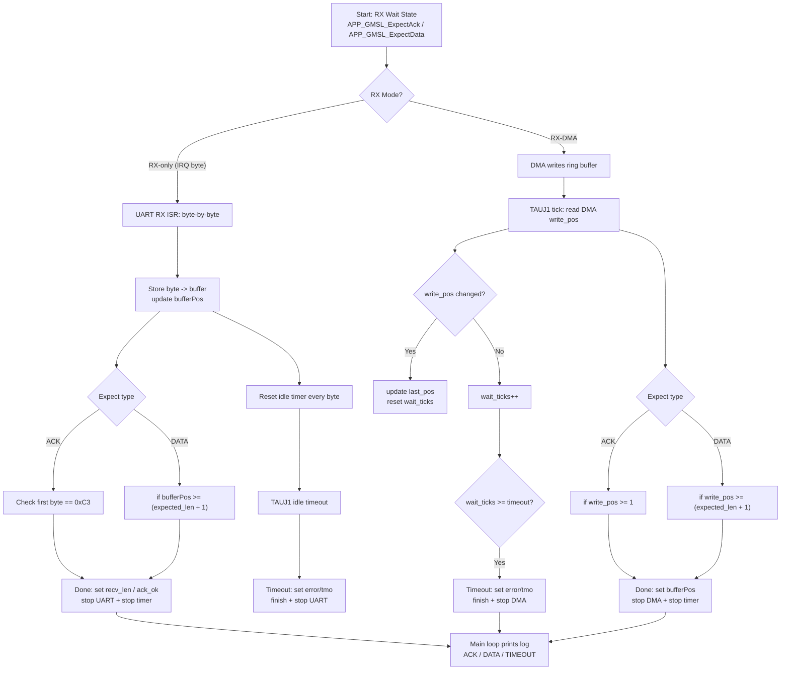


[back to top](#article_top)

---

<a id="article_rx_idle"></a>

## 9. RX idle detection timer

RH850 UART has no idle interrupt , need to use timer for idle detection (target: 2.5 bytes).

```
for uart rx idle timer isr :
8N1 , 1 byte = 10 bits
target : 2.5 bytes = 25 bits

target_isr_timing
- baud rate 115200 = (25 / 115200)*10^6 = 217.0us
- baud rate 415000 = (25 / 415000)*10^6 = 60.24us

timer_freq = PCLK(80MHz) / prescaler(1)
CDR0 = (timer_freq * target_isr_timing/10^6) - 1
- baud rate 115200 217.0us = (80MHz * 217us/10^6) - 1 = 80 * 217 - 1 = 0x43CF
- baud rate 415000 60.24us = (80MHz * 60.24us/10^6) - 1 = 80 * 60.24 - 1 = 0x12D3
```

```c
// #define APP_UART0_BAUD              (415000U)
#define APP_UART0_BAUD              (115200U)

#if (APP_UART0_BAUD == 115200U)
    TAUJ1.CDR0 = 0x43CFU;   /* 217 us = 2.5 bytes @115200 */
#elif (APP_UART0_BAUD == 415000U)
    TAUJ1.CDR0 = 0x12D3U;   /* 60.24 us = 2.5 bytes @415000 */
#else
    #error "Unsupported APP_UART0_BAUD"
#endif
```

[back to top](#article_top)

---

<a id="article_watch"></a>

## 10. Debug watch window

If need to check global variable / array in watch windows, enable **[Access during the execution]** at Debugger Property > Debug Tool Settings tab.

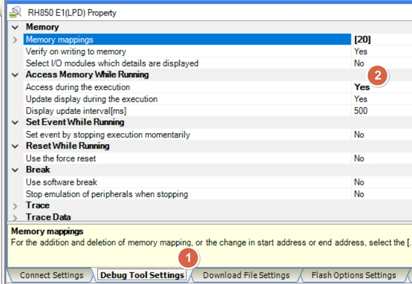

[back to top](#article_top)

---

